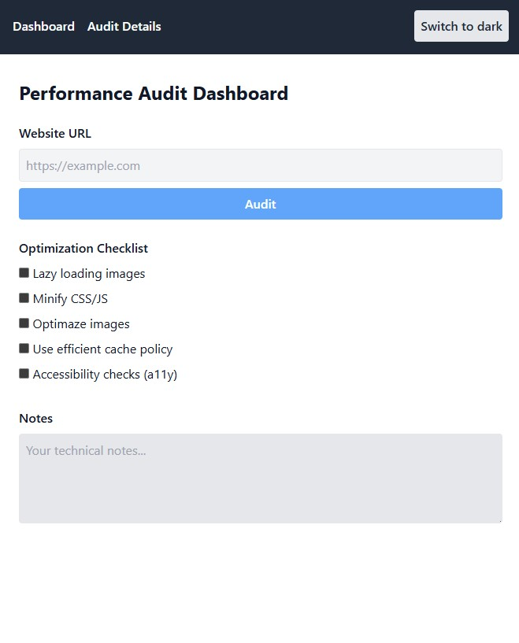

# Performance Audit Dashboard

> 🟢 [Live Demo on Netlify](https://marbel-performance-dashboard-app.netlify.app/)

A modern web application for analyzing, visualizing, and documenting website performance metrics. Includes optimization checklists, real audit data via Google PageSpeed Insights API, and technical notes. 

Built with React, Vite, and Tailwind CSS, focused on clean code, accessibility, and a professional developer workflow.
<br>

## Project Status
🚧 This application is in continuous development.
I plan to maintain and expand it as long as possible, adding new features, improving performance, and keeping up with best practices.

<br>




## Table of Contents

- [Project Overview](#project-overview)
- [Tech Stack](#tech-stack)
- [Features](#features)
- [Getting Started](#getting-started)
- [Development Workflow](#development-workflow)
- [Testing](#testing)
- [Planned Improvements](#planned-improvements)


## Project Overview

Performance Audit Dashboard helps frontend developers practice performance audits, track improvements, and learn best practices in web optimization. 

The app fetches real performance metrics, provides a checklist for optimizations, and allows for technical note-taking. The project is designed to demonstrate modern frontend skills, code quality, understanding the importance of optimization .

---

## MVP & Deployment

- MVP achieved – project is ready for presentation and further development.
- Ready to future improvement and learning.
- [Live Demo](https://marbel-performance-dashboard-app.netlify.app/)

---

## Tech Stack


## Optimization Technologies & Tools

- Lighthouse (performance audits & scoring)
- Chrome DevTools (performance profiling, audits)
- Lazy loading (images, components)
- Code splitting (React.lazy, dynamic imports)
- Minification (CSS/JS via Vite)
- Accessibility (a11y) best practices
- Semantic HTML
- Prettier & ESLint for code quality


## Features

- Real performance metrics via Google PageSpeed Insights API (LCP, FCP, TTI, CLS, FID, Lighthouse Score)
- Optimization checklist with progress tracking
- Technical notes section for audit conclusions
- Modular, accessible UI components
- Responsive design & dark mode
- Code splitting & lazy loading (React.lazy, Suspense)
- Unit and integration tests (Jest, Testing Library)
- ESLint & Prettier for code quality
- Ready for integration with headless CMS (Netlify CMS)

---

## Getting Started

1. Clone the repository:
   ```bash
   git clone https://github.com/marazmlab/performance-dashboard-app.git
   cd performance-dashboard-app
   ```
2. Install dependencies:
   ```bash
   npm install
   ```
3. Start the development server:
   ```bash
   npm run dev
   ```
4. Open [http://localhost:5173](http://localhost:5173) in your browser.


## Development Workflow

- Each feature or fix is committed with a clear, descriptive message (Conventional Commits).
- Modular components and logic separated into `hooks` and `utils`.
- Accessibility (a11y), performance, and code review are prioritized.
- Documentation and tests are updated continuously.
- GitHub + Netlify CI/CD: every push triggers an automatic deploy.

---


## Testing

- Unit and integration tests are written with Jest and React Testing Library.
- To run tests:
  ```bash
  npm test
  ```
- Test coverage is monitored and improved regularly.

---


## Planned Improvements

- User authentication and audit history
- More advanced performance visualizations
- More robust error handling and edge case coverage
- Upgrade optimization checklist with progress tracking
- Upgrade technical notes section for audit conclusions
- Add detailed reports 
- AI integration for optymatization suggestions

---

## Why this project?

- Demonstrates proficiency with modern frontend stack (React, Vite, Tailwind, API integration, testing)
- Example of modular, readable code and a workflow similar to real-world commercial projects
- Ready for CMS integration and further expansion
- Great for future developing

---

## How to run locally

```bash
git clone https://github.com/marazmlab/performance-dashboard-app.git
cd performance-dashboard-app
npm install
npm run dev
# For production build:
npm run build
npm run preview
```

---

## About

Created by Marek Bełz.
Feel free to reach out via [LinkedIn](https://www.linkedin.com/in/belz/) or [GitHub](https://github.com/marazmlab).

